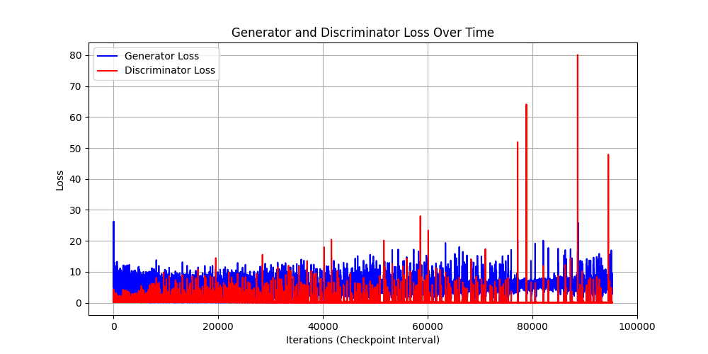

# Image Generation and Classification Project with GAN, Stable Diffusion and VGG16
This project implements a system to generate general images using a **GAN** and **Stable Diffusion**, comparing them with real images taken from COCO dataset.
To predict wheter an image is real or generated, we use a **VGG16**, of which we have removed the last layer and replaced it with an **SVM**, wich we have re-trained to allow us to predict the class (real or generated), of the images.

**Authors**: Pasquale Ricciulli, Francesco Conforti

## Dataset
COCO (Common Objects in Context) is one of the most widely used and comprehensive datasets for the development of computer vision models. It is designed to support various computer vision tasks, such as object recognition, segmentation, image captioning, and contextual understanding.

**Caratteristiche principali del dataset COCO**:

**Annotated images**: The dataset contains more than 330,000 high-resolution images, of which more than 200,000 are annotated with detailed captions.

**Objects and categories**: COCO includes over 80 categories of common objects such as people, animals, vehicles, tools, and utensils found in the images. Each image can contain one or more annotated objects.

**Segmentation and bounding boxes**: In addition to object recognition, COCO provides segmentation annotations for each object, which means that objects are precisely delineated within the image (in addition to the traditional bounding boxes).

**Captions**: An important part of the dataset contains natural language captions describing the content of the images, useful for tasks such as automatic generation of image descriptions or visual question answering (VQA).

**Complex scenes**: COCO images do not only contain isolated objects, but often present objects in real contexts, with overlaps and interactions between objects, which makes the dataset very useful for understanding the relationship between objects in complex environments.

## Stable Diffusion
Stable diffusion is a pre-trained model "stabilityai/stable-diffusion-2-1" that takes annotations from the coco dataset and generates an image with them.
This is an example of image generated by Stable diffusion:


## GAN
The GAN model, on the other hand, was created from scratch by us, has 5 convolutional layers, has a batch size of 128, generates the output images with a resolution of 64x64 and it was trained on coco images over 100 epochs.
these are the result of 1st epoch and 100th epoch:

<p float="left">
  
  
</p>

Below is the graph containing the losses we saved during the training phase:


## VGG16 classifier
This model is used for feature extraction and as a classifier, we have used a pre-trained model for feature extraction, but we have trained an SVM as the last layer of VGG16 to make predictions, in this work, we traind three SVM models, one for **normal images**, one for **64x64 images** and one for **256x256 images**, each SVM model takes as input 3 images, one real with label 1 and two generated images (one for GAN and one for stable) with label 0.
This is an example with original, downsampling to 64x64 and upsampling to 256x256:
<p float="left">
  
  
  
</p>

## Test
In this section we want to find out which is the best model to generate the images.

|**Test type**                        |
|-------------------------------------|
|**Gan 256x256**                      |
|**Stable 256x256**                   |
|**Gan 64x64**                        |
|**Stable 64x64**                     | 
|**Combined 64x64** **Compession 80%**| 
|**Combined 64x64 Compression 60%**   |
|**Combined 64x64 Compression 40%**   | 
|**Combined 64x64**                   |


**GAN 256x256**: This model uses images generated by a GAN at 256x256 resolution. The higher resolution could theoretically allow the classifier to identify finer details and distinctive image features.

**Stable 256x256**: This model uses images generated by Stable Diffusion at 256x256 resolution. Stable Diffusion is known for its ability to generate images of high quality and realism.

**Gan 64x64**: Uses images generated by a 64x64 resolution GAN. The low resolution may limit the classifier's ability to recognise important details.

**Stable 64x64**: Images are generated by Stable Diffusion at 64x64 resolution. Although Stable Diffusion is capable of generating high-quality images, the reduced resolution may affect the classifier's ability to identify significant differences.

**Combined 64x64 compression 80%**: This template contains stable images, gan images and original images and combines low resolution with 80% compression. Compression may further reduce the quality of the images.

**Combined 64x64 compression 60%**: Similar model to the previous one, but with compression reduced to 60%. This could preserve a little more image quality.

**Combined 64x64 compression 40%**: Yet another model using low-resolution images, but with 40 per cent compression.

**Combined 64x64**: This model uses 64x64 images without compression.

The metrics used are **accuracy**, **recall**, **f1-score** and **precision**.

## Results
The results are shown in the table below:
|**Test type**                        | **Accuracy** | **Precision** | **Recall**  |**F1-Score**|
|-------------------------------------|--------------|---------------|-------------|------------|
|**Gan 256x256**                      |  0.8040      |  0.7565       |  0.8206     |  0.8206    |
|**Stable 256x256**                   |  0.8990      |  0.9010       |  0.8987     |  0.8987    |
|**Gan 64x64**                        |  0.5543      |  0.5328       |  0.8805     |  0.6639    |
|**Stable 64x64**                     |  0.5543      |  0.5328       |  0.8805     |  0.6639    |
|**Combined 64x64** **Compession 80%**|  0.7348      |  0.6825       |  0.8780     |  0.7680    |
|**Combined 64x64 Compression 60%**   |  0.7145      |  0.6616       |  0.8780     |  0.7546    |
|**Combined 64x64 Compression 40%**   |  0.6993      |  0.6468       |  0.8780     |  0.7449    |
|**Combined 64x64**                   |  0.6583      |  0.6096       |  0.8805     |  0.7204    |
|**Gan**                              |              |               |             |            |
|**Stable**                           |              |               |             |            |


**GAN 256x256**: It has good accuracy, precision, recall and F1-score metrics, suggesting that the model can discriminate between real and fake images with some effectiveness.

**Stable 256x256**: It shows better results than the GAN model at 256x256, with high accuracy and precision metrics. This indicates that the classifier can distinguish fake images more reliably.

**Gan 64x64**: It shows significantly lower results than the other models, with low precision and recall. This suggests that the low-resolution images do not provide sufficient information for effective classification.

**Stable 64x64**: The metrics are similar to those of the 64x64 GAN, showing that the low resolution limits the effectiveness of this model.

**Combined 64x64 compression 80%**: It shows improvements over the 64x64 models without compression, suggesting that the inclusion of images from all models helps improve classification capability, although it remains insufficient compared to the 256x256 models.

**Combined 64x64 compression 60%**: The results show a further improvement over the gan and stable 64x64 models.

**Combined 64x64 compression 40%**: This model has the worst metrics among the 64x64 models with compression, indicating that less compression, even in small sizes, can worsen the performance of the classifier.

**Combined 64x64**: It has the lowest performance metrics among the combined models, confirming that without compression, low resolution limitations negatively affect the model's ability to distinguish images.


## Structure of the project
- `Test/`
  - `Notebook/`
    -`test-cv.ipynb`:This file could be uploaded to kaggle to work.
  - `src/`
    - `config.py`:Configuration file that defines file paths and directories, including COCO annotations, directories for generated images, and SVM model checkpoints​.
    - `data_loader.py`:Defines custom datasets for loading and preprocessing images, with or without compression, and creates DataLoaders for batch processing of images.
    - `generator.py`:Contains the definition and loading of the GAN generator model used to generate images from a latent vector. It also includes a function to load a pre-trained generator model from a checkpoint.
    - `main.py`:The main script that sets up the environment, loads the GAN and Stable Diffusion models, generates images, and calculates evaluation metrics like FID and IS. It also handles COCO annotations and performs classification using an SVM classifier​.
    - `metrics.py`:Implements functions to calculate the Inception Score (IS), Fréchet Inception Distance (FID), and classification metrics (Accuracy, Precision, Recall, F1 Score). It also includes a function to save the metric results.
    - `setup_env.py`:Manages the environment setup by checking for GPU availability and loading the Stable Diffusion pipeline for image generation​.
    - `stable_diffusion_pipeline.py`: Provides functions to load the Stable Diffusion pipeline and generate images based on text prompts​.
    - `vgg16_classifier`:Contains functions to load a pre-trained VGG16 model for image feature extraction and to load a pre-trained SVM classifier.
      
- `VGG16/`
  - `training-vgg16.ipynb`: This file could be uploaded to kaggle to work.
  - `training_VGG16_64_256`: This file contains the code for training the SVM model with image sizes 64x64 and 256x256 from coco.
  - `training_VGG16_normal.py`: This file contains the code for generating the fake images with stable diffusion, for creating the dataset for training and testing and also for training the model on images without scaling.

- `GAN/`
  - `Generator.py`: This file contains the code for generating the fake images with GAN.
  - `training_GAN.py`: This file contains the code for training the GAN model with image from coco.
  - `gan.ipynb`: This file could be uploaded to kaggle to work
## Installation

1. Clone the repository.
   ```bash
   git clone https://github.com/PasqualeRic/Deep-fake-detection.git
   cd Deep-fake-detection

