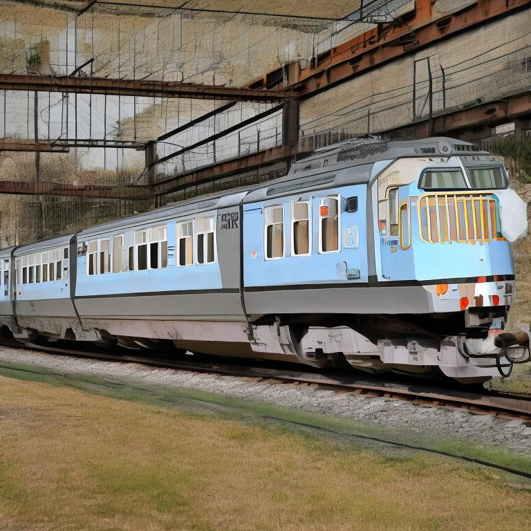
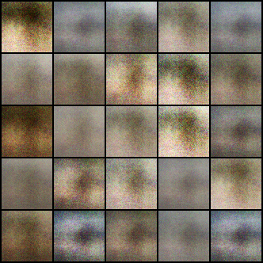
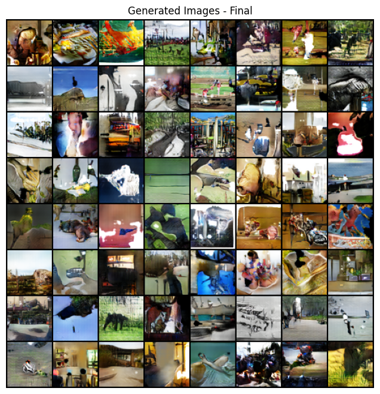
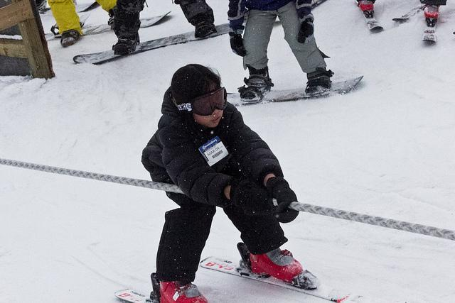

# Image Generation and Classification Project with GAN, Stable Diffusion and VGG16
This project implements a system to generate general images using a GAN and Stable Diffusion, comparing them with real images taken from COCO dataset.
To predict wheter an image is real or generated, we use a VGG16,of which we have removed the last layer and replaced it with an SVM, wich we have re-trained to allow us to predict the class (real or generated), of the images.
## Stable Diffusion
Stable diffusion is a pre-trained model "stabilityai/stable-diffusion-2-1" that takes annotations from the coco dataset and generates an image with them.
This is an example of image generated by Stable diffusion:




## GAN
The GAN model, on the other hand, was created from scratch by us, has 5 convolutional layers, has a batch size of 128, generates the output images with a resolution of 64x64 and it was trained on coco images over 100 epochs.
these are the result of 1st epoch and 100th epoch:

<p float="left">
  
  
</p>

## VGG16 classifier
This model is used for feature extraction and as a classifier, we have used a pre-trained model for feature extraction, but we have trained an SVM as the last layer of VGG16 to make predictions, in this work, we traind three SVM models, one for normal images, one for 64x64 images and one for 256x256 images, each SVM model takes as input 3 images, one real with label 1 and two generated images (one for GAN and one for stable) with label 0.
This is an example with original, downsampling to 64x64 and upsampling to 256x256:
<p float="left">
  
  
  
</p>

## Test


In this section we want to find out which is the best model to generate the images, so we pass the Gan-generated images and the original images to the classifier and calculate the metrics, we repeat this operation for the stable diffusion images as well, after which we train two more classifiers one for 64x64 images and one for 256x256 images, then upsample or downsample the images and calculate the metrics again.

In the end, we tested whether the classifier improves its metrics with images at different compression levels.
The metrics used are accuracy, recall, f1-score and precision, 

## Structure of the project
- `Test/`
  - `Notebook/`
    -`Test.ipynb`:This file could be uploaded to kaggle to work.
  - `src/`
    - `config.py`:Configuration file that defines file paths and directories, including COCO annotations, directories for generated images, and SVM model checkpoints​.
    - `data_loader.py`:Defines custom datasets for loading and preprocessing images, with or without compression, and creates DataLoaders for batch processing of images.
    - `generator.py`:Contains the definition and loading of the GAN generator model used to generate images from a latent vector. It also includes a function to load a pre-trained generator model from a checkpoint.
    - `main.py`:The main script that sets up the environment, loads the GAN and Stable Diffusion models, generates images, and calculates evaluation metrics like FID and IS. It also handles COCO annotations and performs classification using an SVM classifier​.
    - `metrics.py`:Implements functions to calculate the Inception Score (IS), Fréchet Inception Distance (FID), and classification metrics (Accuracy, Precision, Recall, F1 Score). It also includes a function to save the metric results.
    - `setup_env.py`:Manages the environment setup by checking for GPU availability and loading the Stable Diffusion pipeline for image generation​.
    - `stable_diffusion_pipeline.py`: Provides functions to load the Stable Diffusion pipeline and generate images based on text prompts​.
    - `vgg16_classifier`:Contains functions to load a pre-trained VGG16 model for image feature extraction and to load a pre-trained SVM classifier.
      
- `VGG16/`
  - `training-vgg16.ipynb`: This file could be uploaded to kaggle to work.
  - `training_VGG16_64_256`: This file contains the code for training the SVM model with image sizes 64x64 and 256x256 from coco.
  - `training_VGG16_normal.py`: This file contains the code for generating the fake images with stable diffusion, for creating the dataset for training and testing and also for training the model on images without scaling.

- `GAN/`
  - `Generator.py`: This file contains the code for generating the fake images with GAN.
  - `training_GAN.py`: This file contains the code for training the GAN model with image from coco.
  - `gan.ipynb`: This file could be uploaded to kaggle to work
## Installation

1. Clone the repository.
   ```bash
   git clone https://github.com/PasqualeRic/Deep-fake-detection.git
   cd Deep-fake-detection

